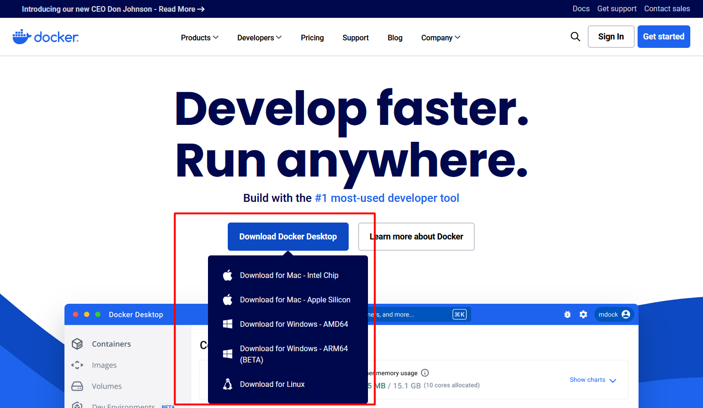

# Learning Docker
A Beginner's Guide to Docker. In this repo, you'll be learning mainly how to get started with Docker. The very bascis. Right now this file is jsut to get you started. No major concepts. More information will be added to this file later on.

## Step # 1: 
Go to https://www.docker.com/. 

## Step # 2: 
Select and download the version according to your OS.

## Step # 3: 
Run the setup and complete the Installation

## Docker Tutorials
These are two very excellent tutorials that helped to start using Docker
+ [How to Get Started with Docker](https://www.youtube.com/watch?v=iqqDU2crIEQ)
+ [Learn Docker in 1 Hour](https://www.youtube.com/watch?v=GFgJkfScVNU)